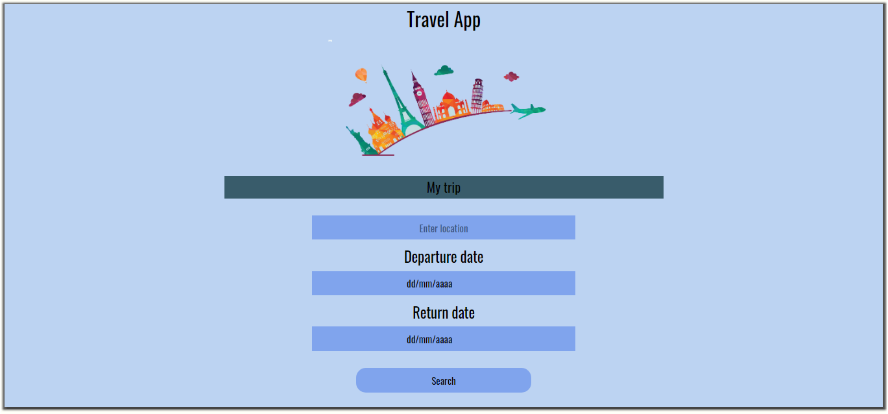
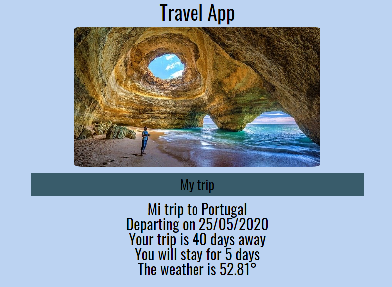

# Travel APP

This is the last project in Front-end Udacity Nanodegree.

The objective of this project is to build a travel application that uses the information incoming from the user (location and date) to show him some information about the trip.



The app shows the following information:
- A photo of the city.
- The weather in that city.
- How many days is your trip away.
- How many days is going to take the trip.



*Travel Results*


## How to start

`cd` into your new folder and run:
- ```npm install```
- ```npm start``` to start the server
- ```npm run build-dev``` to start the app

## Test

Installed JEST and created two tests on ./src/js files to check input validation functionality and async function. To test the app just run ```npm test```

## Skills that I have to use

- Javascript
- Node.js
- Express
- Webpack
- Sass
- Git

## Built With

* [Visual Studio Code](https://code.visualstudio.com/)
* [Geonames API](https://www.geonames.org/)
* [DarkSkys API](https://darksky.net/dev)
* [Pixabay API](https://pixabay.com/es/service/about/api/)

## Authors

* **Itziar Urbieta** (https://github.com/ThisIsItz)

